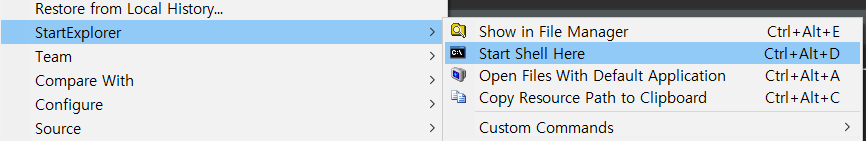

## 1. Node.js 설치

아래 사이트에서 설치 

https://nodejs.org/ko/

설치 확인
~~~
C:/>npm --version
6.4.1
~~~

## 2. nodejs 플러그인 설치

> 이클립스 마켓에서 nodeclipse 설치

## 3. 프로젝트 생성 (nodejs)

1) New -> Node.js Project

2) Template to use -> Hello World

3) hello-world-server.js -> 좌측버튼 Run As Node.js Application

4) http://127.0.0.1:1337/ -> Hello World 출력

## 4. 프로젝트 생성 (express)
1) New -> Node.js Express Project

2) 패키지 우측버튼 -> StartExplrer -> Start Shell Here

3) 
~~~
C:\>npm install express
--> express 설치

C:\>npm install mysql
--> mysql 설치
~~~

4) 설치 확인

**app.js**
~~~javascript
const express = require('express');
const app = express();

app.get('/', (req, res) => res.send('Hello World!'));

app.listen(3000, () => console.log('Example app listening on port 3000!'));
~~~

테스트

Console 내용
~~~
Example app listening on port 3000!
~~~
**connect.js**
~~~javascript
var mysql      = require('mysql');
var connection = mysql.createConnection({
  host     : 'localhost',
  user     : '유저명',
  password : '패스워드',
  port     : 포트,
  database : '사용DB'
});

connection.connect();

connection.query('SELECT * from TB', function(err, rows, fields) {
  if (!err)
    console.log('The solution is: ', rows);
  else
    console.log('Error while performing Query.', err);
});

connection.end();
~~~

Console 내용
> Table 조회 내용이 출력됨

